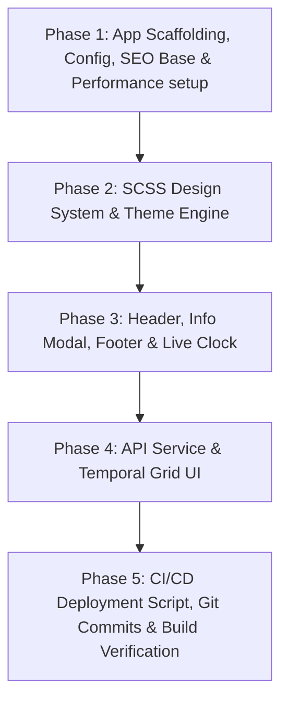

# Implementation Plan: WhatShouldIDoNow App Scaffolding, SCSS Design System, SEO, Speed Optimization, Git Workflow & CI/CD Deployment

**Topic Name:** WhatShouldIDoNow  
**Issue Name:** AppScaffolding-CICD  
**Specification:** `ai-work/WhatShouldIDoNow-AppScaffolding-CICD-SPEC.md`  

## 1. Overview & Architectural Philosophy
Build a minimal, high-performance React + TypeScript micro-frontend powered by Vite. The UI implements a Nordic Minimalist design system with custom SCSS, live digital clock (`HH:mm:ss`), system theme auto-detection with light/dark toggle, purpose drawer/modal, subtle creator attribution to [alexseif.com](https://alexseif.com), comprehensive SEO metadata (OpenGraph, Twitter Cards, Schema.org JSON-LD), **Core Web Vitals loading speed optimization** (preconnect resources, `font-display: swap`, ultra-minimal bundle footprint), **Healthy Git Workflow** (Conventional Commits with atomic commits per task), 3-column responsive temporal blocks layout, environment variable management (`VITE_WUWEI_API_URL`), authentication header support, and a `deployer.sh` deployment script for DigitalOcean server sync.

## 2. Dependency Graph

## 3. Phased Work Breakdown & Vertical Slices

### Phase 1: Application Scaffolding, Build Config, Healthy SEO Setup & Speed Optimization
- **Task 1.1: Initialize Vite + React + TypeScript Project Core, SEO & Speed HTML**
  - Setup `package.json`, `tsconfig.json`, `tsconfig.node.json`, `vite.config.ts`, `.gitignore`.
  - Configure `.env.example`, `.env.local`, and `src/vite-env.d.ts`.
  - Implement full SEO & Speed suite in `index.html`:
    - Title: `WhatShouldIDoNow | Wuwei Ecosystem Temporal Dashboard`
    - Meta description, author (`Alex Seif (alexseif.com)`), OpenGraph tags (`og:title`, `og:description`, `og:type`), Twitter Cards, canonical link.
    - Resource hints: `dns-prefetch` and `preconnect` for Google Fonts (`fonts.googleapis.com`, `fonts.gstatic.com`).
    - JSON-LD `WebApplication` structured schema with creator attribution (`https://alexseif.com`).
  - Add `sass` dependency for SCSS compilation.
  - *Git Commit*: `chore: initialize vite react ts scaffolding with seo & speed configuration`
  - *Acceptance Criteria*: Project builds cleanly via `npm run build` and `tsc --noEmit`. `index.html` has valid SEO, speed preconnects, and author metadata.

### Phase 2: SCSS Design System, Theme Engine & Performance Styling
- **Task 2.1: Custom SCSS Tokens, Font Display Optimization & Theme System (`useTheme`)**
  - Implement `src/styles/_variables.scss`, `src/styles/_mixins.scss`, `src/styles/main.scss`.
  - Import Google Fonts with `font-display: swap` (`Space Grotesk`, `Inter`, `Space Mono`).
  - Create `useTheme` hook with `prefers-color-scheme` auto-detection and `localStorage` persistence.
  - *Git Commit*: `feat(styles): implement scss design system, font-display swap and theme hook`
  - *Acceptance Criteria*: CSS custom properties switch themes cleanly without layout flash (CLS = 0).

### Phase 3: Header, Info Drawer/Modal, Footer Attribution & Live Clock
- **Task 3.1: Header & InfoModal Components**
  - Implement `Header.tsx` with single `<h1>` brand title, theme toggle (Sun/Moon), and `i` info icon.
  - Implement `InfoModal.tsx` displaying Wuwei ecosystem context and attribution acknowledging Alex Seif (`alexseif.com`) as architect.
- **Task 3.2: Digital Clock Centerpiece & Subtle Footer Component**
  - Implement `DigitalClock.tsx` using `Space Mono` typography and a minimal border frame (`HH:mm:ss` ticker).
  - Implement `Footer.tsx` containing subtle, elegant attribution: `"Crafted by Alex Seif (alexseif.com) for the Wuwei Ecosystem"`.
  - *Git Commit*: `feat(ui): add header, digital clock, info modal and subtle footer attribution`
  - *Acceptance Criteria*: Clock updates accurately every second. Info modal opens/closes cleanly. Footer displays subtle link to `alexseif.com`.

### Phase 4: API Service Layer & Responsive Temporal Grid
- **Task 4.1: Data Types & API Service Layer**
  - Define `types/temporal.ts` for temporal block payloads.
  - Build `services/api.ts` native `fetch` service injecting `VITE_WUWEI_API_URL` and Bearer auth headers.
- **Task 4.2: Temporal Grid Component & Semantic Page Assembly**
  - Implement `TemporalGrid.tsx` rendering active blocks (System Name, Primary Attribute badge, Active details, Tags).
  - 1-column grid on mobile (`< 768px`), 3-column grid on desktop (`≥ 768px`).
  - Include fallback mock data for offline/standalone execution.
  - Assemble `App.tsx` using semantic HTML5 tags (`<header>`, `<main>`, `<section>`, `<footer>`).
  - *Git Commit*: `feat(grid): build api service and responsive 3-column temporal grid`
  - *Acceptance Criteria*: Grid renders responsive 1/3 column cards smoothly with zero visual bugs. Semantic HTML structure is complete.

### Phase 5: CI/CD Deployment Script, Final Verification & Healthy Git History
- **Task 5.1: Executable Deployment Script (`deployer.sh`) & Git Status Verification**
  - Create `deployer.sh` with `git fetch origin main`, `git reset --hard origin/main`, `npm ci`, `npm run build`.
  - Make `deployer.sh` executable (`chmod +x`).
  - *Git Commit*: `feat(cicd): add deployer.sh script for automated deployment`
  - *Acceptance Criteria*: `bash -n deployer.sh` checks syntax; `npm run build` produces production `dist/` bundle cleanly with minimal footprint (< 50KB gzipped). Git log reflects atomic, conventional commit history.

---

## 4. Token Cost Estimate & Industry Benchmark

| Phase | Estimated Input Tokens | Estimated Output Tokens | Total Estimated Tokens | Benchmark Cost (Gemini Flash API Rate) |
|---|---|---|---|---|
| Phase 1: Scaffolding, Config, SEO & Speed | ~17,000 | ~4,000 | ~21,000 | ~$0.0025 |
| Phase 2: SCSS & Theme Engine | ~20,000 | ~4,000 | ~24,000 | ~$0.0027 |
| Phase 3: Header, Clock, Info Modal & Footer | ~27,000 | ~5,500 | ~32,500 | ~$0.0037 |
| Phase 4: API & Temporal Grid | ~30,000 | ~6,000 | ~36,000 | ~$0.0041 |
| Phase 5: CI/CD Deployer, Git & Verification | ~16,000 | ~3,000 | ~19,000 | ~$0.0021 |
| **Total Estimated** | **~110,000** | **~22,500** | **~132,500** | **~$0.0151** |

### Token Optimization Advice
1. Perform file modifications cleanly using targeted contiguous edits or complete initial writes.
2. Use `tsc --noEmit` and `npm run build` directly for verification.
3. Keep components focused, modular, and non-redundant.

---

## 5. Verification Checkpoints & Git Commit Milestones
- [ ] Checkpoint 1: `tsc --noEmit` passes with 0 type errors.
- [ ] Checkpoint 2: SEO metadata (OpenGraph, Twitter Cards, JSON-LD schema) and speed optimizations (`dns-prefetch`, `preconnect`) present in `index.html`.
- [ ] Checkpoint 3: Footer and InfoModal correctly feature subtle attribution link to `alexseif.com`.
- [ ] Checkpoint 4: Theme toggle correctly updates `data-theme` attribute and `localStorage`.
- [ ] Checkpoint 5: `npm run build` succeeds, bundle size < 50KB gzipped.
- [ ] Checkpoint 6: `deployer.sh` syntax verified and executable.
- [ ] Checkpoint 7: Clean git history with atomic conventional commits for all tasks.
